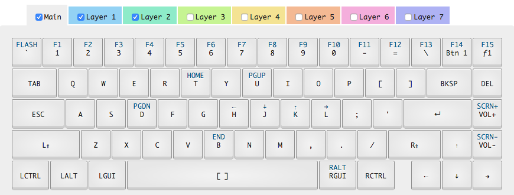

## [WhiteFox Configurator](https://input.club/whitefox/)

<hr>

## Layout

<hr>

### v0.5.0



<hr>

## Configuration

<hr>

### Prereq

#### [Device Firmware Upgrade Utilities](http://dfu-util.sourceforge.net/)
- Install dfu-util to allow the download and upload firmware to/from devices connected over USB.

#### [Keyboard Configurator](https://input.club/configurator/)
- Configure the function layers through the web interface and save to download the zip file.

## Setup

1. Unzip the configuration zip file.
2. Change to the directory where the files were extracted.
3. Press the `flash` key or insert a pin in the hole on the bottom of the keyboard.
   - Orange LED will turn on
4. Flash the keyboard using the following command:

   - ```dfu-util -a 0 -R -D kiibohd.dfu.bin```

⇧⌃⌥⌘